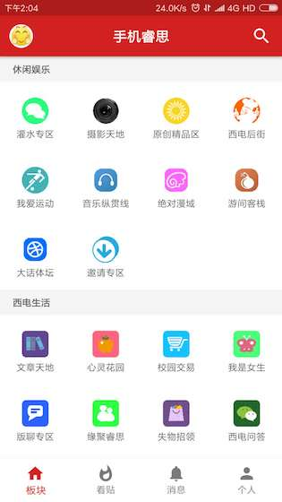
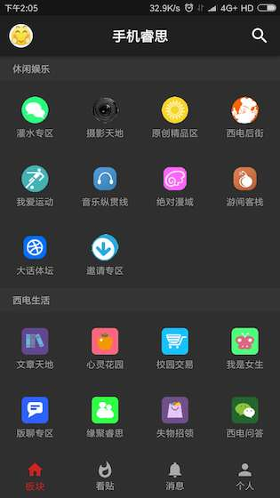
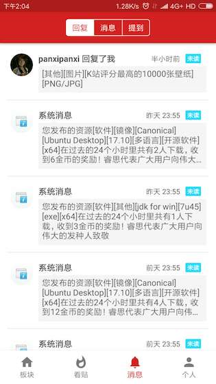

## 博山庐手机客户端
博山庐手机客户端是基于西安电子科技大学校园睿思论坛Android客户端开源项目在Apache License V2.0下二次开发的项目，原项目地址：https://github.com/freedom10086/Ruisi
支持夜间模式，支持主题，如有bug，或者新功能建议欢迎提出Issue .   

### 更新地址:

[博山庐](https://boshanlu.com/forum.php?mod=viewthread&tid=4289) 

### 软件截图

### 参考和用到的开源库和软件：

[AsyncLiteHttp](https://github.com/luck-apple/AsyncLiteHttp)

[CNode-Material-Design](https://github.com/TakWolf/CNode-Material-Design)

[CircleImageView](https://github.com/hdodenhof/CircleImageView)

[jsoup](http://jsoup.org/)

[picasso](https://github.com/square/picasso)

[material-design-icons](https://github.com/google/material-design-icons)

### License

    Copyright 2016-2017 freedom10086

    Licensed under the Apache License, Version 2.0 (the "License");
    you may not use this file except in compliance with the License.
    You may obtain a copy of the License at
    
       http://www.apache.org/licenses/LICENSE-2.0
    
    Unless required by applicable law or agreed to in writing, software
    distributed under the License is distributed on an "AS IS" BASIS,
    WITHOUT WARRANTIES OR CONDITIONS OF ANY KIND, either express or implied.
    See the License for the specific language governing permissions and
    limitations under the License.
